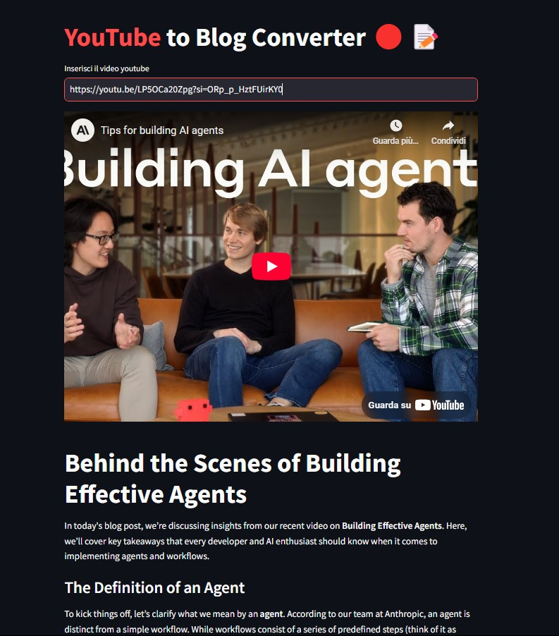
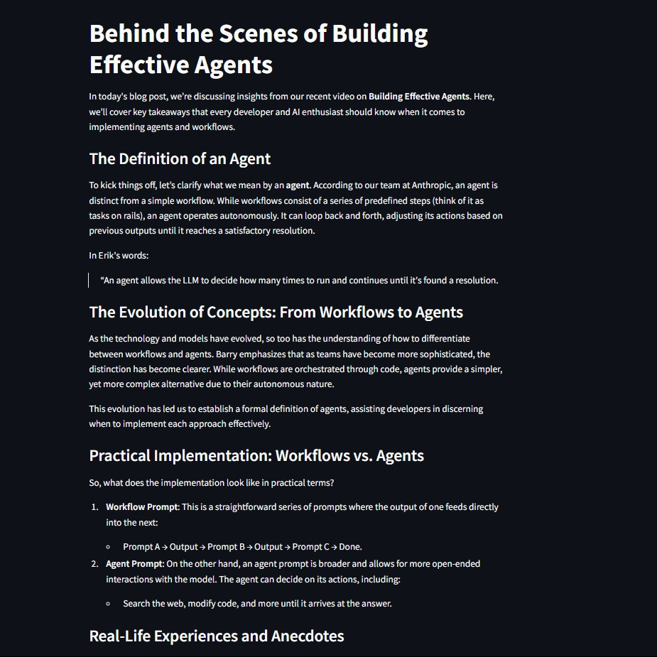

# YouTube to Blog Converter 🔴📝

Questo progetto converte automaticamente il contenuto di un video YouTube in un post di blog formattato in Markdown, utilizzando la trascrizione del video e un modello linguistico (LLM).

## Problema

Creare contenuti scritti a partire da video può essere un processo lungo e tedioso. Richiede la trascrizione manuale del video e la successiva rielaborazione del testo in un formato adatto a un blog, richiedendo tempo e sforzo significativi.

## Soluzione

Questa applicazione semplifica il processo:
1.  **Input:** L'utente inserisce l'URL di un video YouTube nell'interfaccia web.
2.  **Trascrizione:** L'applicazione estrae automaticamente la trascrizione del video (supportando inglese e italiano).
3.  **Elaborazione LLM:** La trascrizione viene inviata a un modello LLM (GPT-4o-mini tramite Langchain) con istruzioni specifiche per generare un post di blog.
4.  **Output:** Il post del blog generato viene visualizzato direttamente nell'interfaccia, formattato in Markdown per una facile lettura e copia.

## UI/Frontend

L'interfaccia utente è costruita con Streamlit e permette un'interazione semplice: inserimento del link e visualizzazione del risultato.





## Tech Stack

*   **Linguaggio:** Python 3.12
*   **Frontend/UI:** Streamlit
*   **Trascrizione Video:** `youtube-transcript-api`
*   **LLM Interaction:** Langchain, OpenAI (GPT-4o-mini)

## Come Installare ed Eseguire (Localmente)

Per eseguire l'applicazione direttamente sulla tua macchina locale, segui questi passaggi:

**Prerequisiti:**
*   Python 3.12 installato sul tuo sistema.
*   `pip` (il package installer per Python).
*   Una chiave API OpenAI.

**Installazione:**

1.  **Clona il repository:**
    ```bash
    git clone https://github.com/RazakHamidu/YouTube-to-Blog-Converter.git
    cd YouTube-to-Blog-Converter
    ```


2.  **Crea e attiva un ambiente virtuale (consigliato):**
    *   Su macOS/Linux:
        ```bash
        python3 -m venv venv
        source venv/bin/activate
        ```
    *   Su Windows:
        ```bash
        python -m venv venv
        .\venv\Scripts\activate
        ```

3.  **Installa le dipendenze:**
    ```bash
    pip install -r requirements.txt
    ```

4.  **Crea il file `.env`:**
    Nella cartella `app`, crea un file chiamato `.env` e aggiungi la tua chiave API OpenAI:
    ```env
    OPENAI_API_KEY='la_tua_chiave_api_openai'
    ```
    *Assicurati che questo file non venga tracciato da Git se il repository è pubblico (aggiungilo al `.gitignore`).*

5.  **Esegui l'applicazione Streamlit:**
    ```bash
    streamlit run main.py
    ```

6.  **Accedi all'applicazione:**
    Apri il tuo browser web e vai all'URL fornito da Streamlit (solitamente `http://localhost:8501`).

## Utilizzo

1.  Apri l'applicazione nel browser.
2.  Incolla l'URL completo di un video YouTube nel campo di testo "Inserisci il video youtube".
3.  Premi Invio o attendi che l'applicazione processi il link.
4.  Il video verrà mostrato, seguito dal post del blog generato in formato Markdown.


## Contributi

I contributi sono benvenuti! Si prega di aprire una issue o una pull request per suggerire miglioramenti o correggere bug.

